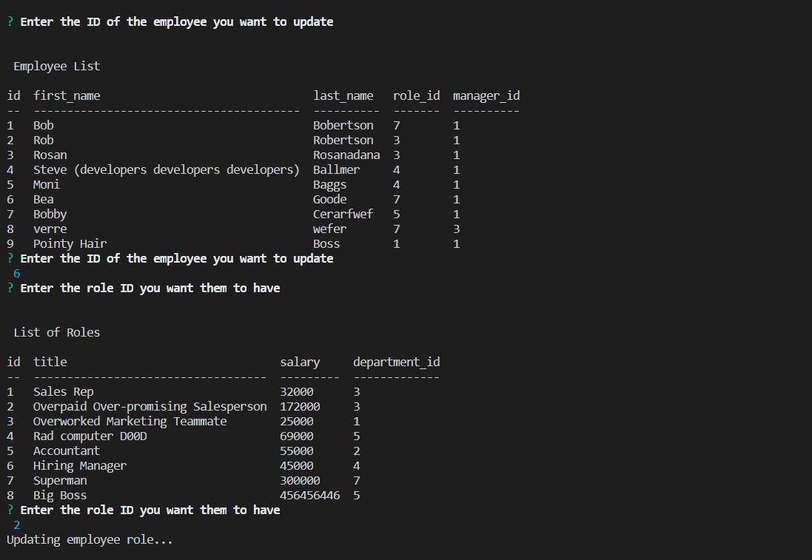

# mySQLEmployeeTrackerCMS
 
    # Employee Profile Generator 
   
    This program generates an employee database that can be edited. It contains information on their name, role, salary, manager, and department information.
    
* [Installation](#Installation)
    
* [Instructions](#Instructions)
    
* [License](#License)
       
    ## Installation
    Download and setup the schema on a MySQL server. Create a .env file with DB_PASSWORD as your MySQL DB password. Edit/add the seed data if you want a starting point.
    ## Instructions
    While having node.js installed and this folder selected, type "node server.js" into the terminal. Follow the prompts to view or edit the database. A video of this program being used can be found at: https://youtu.be/i-uorBXuJLA

    ## License 
    This project is licensed under the MIT license
    - Email: timiholzer@gmail.com - GitHub Repo: https://github.com/timholzer/mySQLEmployeeTrackerCMS
    

